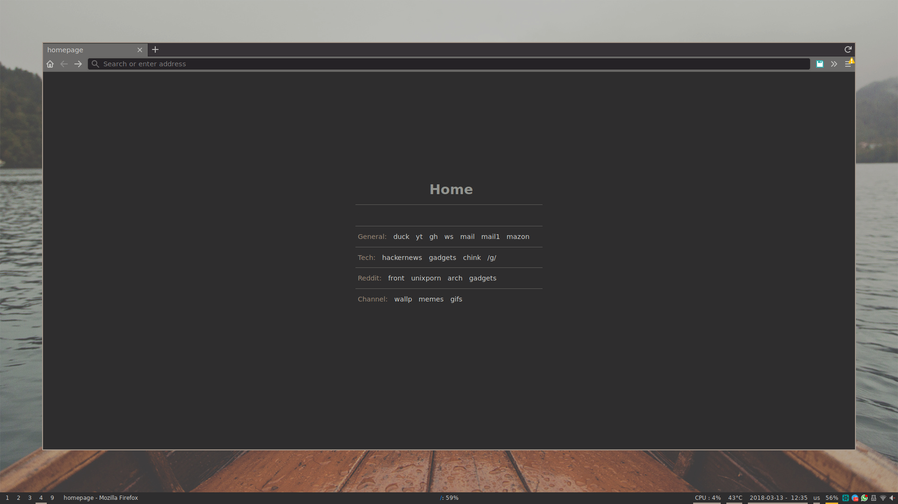

# startpage-wal

## A minimalistic startpage with DuckDuckGo search bar.

Fork of "startpage" project by [Emil Lynegaard](https://github.com/ecly/startpage), itself fork of [Dylan Araps's original project](https://github.com/dylanaraps/startpage)

The stylesheet of the startpage depends [on wal's css](https://github.com/dylanaraps/pywal)

I guess the startpage itself should be prety easy to customize as you like, at this moment the links I included are:

#### General:
- DuckDuckGo
- Youtube
- Github
- Whatsapp Web
- Gmail

#### Tech
- Hackernews
- Sunsky
- Aliexpress
- 4chan /g/

#### Reddit
- Frontpage
- Unixpr0n
- Arch Linux
- Gadgets

#### 4Chan (Channel)
- Wallpaper General (wg)
- Memes (Random, NSFW) (b)
- Worksafe GIFs (wsg)

## Screenshot:

